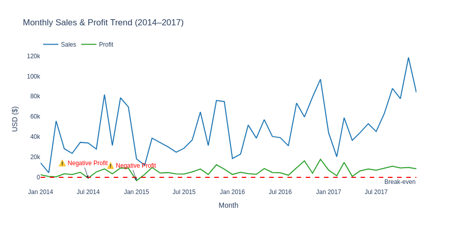
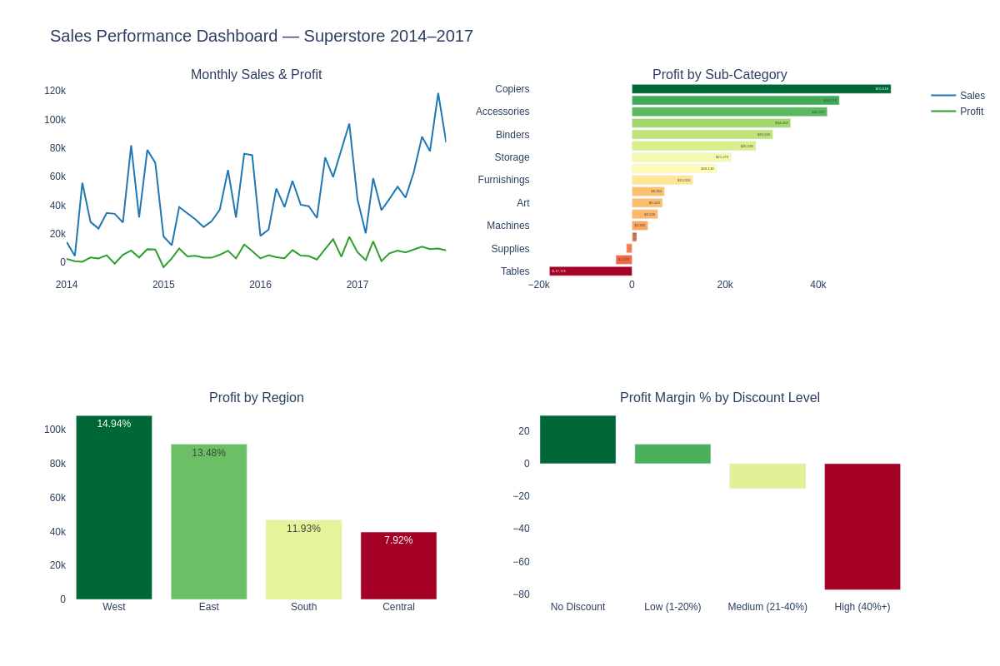

# 📊 Sales Performance Dashboard — Superstore 2014–2017

> Analyze the business performance of a US retail company to identify profitability issues and recommend actionable improvements.

---

## 📁 Dataset

| Info | Details |
|---|---|
| **Source** | [Superstore Dataset — Kaggle](https://www.kaggle.com/datasets/vivek468/superstore-dataset-final) |
| **Size** | 9,994 orders × 21 columns |
| **Period** | Jan 2014 → Dec 2017 |
| **Scope** | United States — 4 regions (West, East, South, Central) |

**Key columns used:**

| Column | Description |
|---|---|
| `Order Date` | Date the order was placed |
| `Category` / `Sub-Category` | Product grouping |
| `Region` | Sales territory |
| `Sales` | Revenue in USD |
| `Profit` | Net profit after costs |
| `Discount` | Discount rate applied (0.0 → 1.0) |

---

## 🛠️ Tools

| Tool | Purpose |
|---|---|
| Python 3 | Data processing & analysis |
| Pandas | Data manipulation & aggregation |
| Plotly | Interactive charts & dashboard |

---

## 🔄 Data Processing Steps

### Step 1 — Load & Inspect

```python
import pandas as pd

df = pd.read_csv("Sample - Superstore.csv", encoding="latin-1")
df.head()
df.shape
df.info()
```

Quality check results:
- ✅ No null values: `df.isnull().sum()` → all zeros
- ✅ No duplicate rows: `df.duplicated().sum()` → 0

### Step 2 — Feature Engineering

```python
# Parse date column
df['Order Date'] = pd.to_datetime(df['Order Date'])

# Extract time dimensions
df['Year']  = df['Order Date'].dt.year
df['Month'] = df['Order Date'].dt.to_period('M')

# Bin discount into groups for analysis
df["Discount Group"] = pd.cut(
    df["Discount"],
    bins=[-0.01, 0, 0.2, 0.4, 1.0],
    labels=["No Discount", "Low (1-20%)", "Medium (21-40%)", "High (40%+)"]
)
```

### Step 3 — Aggregation

```python
# Monthly totals
monthly = df.groupby('Month')[['Sales', 'Profit']].sum().reset_index()

# By sub-category
sub_cat = df.groupby("Sub-Category")[["Sales", "Profit"]].sum().reset_index()
sub_cat["Profit Margin %"] = (sub_cat["Profit"] / sub_cat["Sales"] * 100).round(2)

# By region
region = df.groupby("Region")[["Sales", "Profit"]].sum().reset_index()
region["Profit Margin %"] = (region["Profit"] / region["Sales"] * 100).round(2)

# By discount group (average per order)
discount = df.groupby("Discount Group", observed=True)[["Sales", "Profit"]].mean().reset_index()
discount["Profit Margin %"] = (discount["Profit"] / discount["Sales"] * 100).round(2)
```

---

## 📊 Overall KPIs

| KPI | Value |
|---|---|
| Total Revenue | $2,297,201 |
| Total Profit | $286,397 |
| Overall Profit Margin | 12.47% |
| Total Orders | 9,994 |

---

## 🔍 Analysis — 4 Business Questions

### Q1: Is the business growing profitably over time?



**Key findings:**
- Sales shows a clear upward trend from 2014 → 2017, peaking at **$118,448** in Nov 2017
- **Profit does not grow proportionally** — the gap between Sales and Profit widens over time
- **2 months with negative profit:** Jul 2014 (-$841) and Jan 2015 (-$3,281)
- Strong **Q4 seasonality** every year (Sep–Nov consistently peaks)

**Business implication:**
> Revenue is growing but profit is not keeping pace — costs or discounts are eating into margins. The company needs to track Profit Margin alongside revenue targets.

---

### Q2: Which Sub-Categories are making or losing money?


**Loss-making:**

| Sub-Category | Profit | Margin % |
|---|---|---|
| Tables | -$17,725 | -8.56% |
| Bookcases | -$3,473 | -3.02% |
| Supplies | -$1,189 | -2.55% |

**Top profitable:**

| Sub-Category | Profit | Margin % |
|---|---|---|
| Copiers | +$55,618 | 37.20% |
| Phones | +$44,516 | 13.49% |
| Accessories | +$41,937 | 25.05% |

**Business implication:**
> All 3 loss-making sub-categories belong to **Furniture** — a structural issue, not a coincidence. Meanwhile, Copiers delivers 37.2% margin (3× company average), signaling strong opportunity to grow the Technology segment.

---

### Q3: Which region is performing best?


| Region | Sales | Profit | Margin % |
|---|---|---|---|
| West | $725,458 | $108,418 | **14.94%** |
| East | $678,781 | $91,523 | 13.48% |
| South | $391,722 | $46,749 | 11.93% |
| Central | $501,240 | $39,706 | **7.92%** |

**Business implication:**
> Central generates more revenue than South but keeps nearly half the margin. The company is selling a lot in Central but retaining very little — likely due to excessive discounting or higher operating costs.

---

### Q4: Is discounting hurting profitability?


| Discount Group | Avg Profit Margin % |
|---|---|
| No Discount | **+29.51%** |
| Low (1–20%) | +11.91% |
| Medium (21–40%) | **-15.30%** |
| High (40%+) | **-77.40%** |

**Business implication:**
> The danger threshold is **21%** — any discount above this results in a loss. At 40%+, the company loses $77 on every $100 of revenue. Sales teams may be using aggressive discounts to hit revenue targets without accounting for profit impact.

---

## 📈 Combined Dashboard



> 💡 For the fully interactive version, open `Sales_Dashboard.html` in any browser.

---

## 💡 Summary & Recommendations

| # | Finding | Recommendation |
|---|---|---|
| 1 | Sales grows but profit lags behind | Set Profit Margin KPIs alongside revenue targets |
| 2 | Tables losing -$17,725 at -8.56% margin | Review pricing or consider discontinuing |
| 3 | Central margin only 7.92% | Investigate root cause: costs or discount behavior |
| 4 | Discounts 40%+ cause -77.4% margin | Cap maximum discount at 20% company-wide |
| 5 | Copiers at 37.2% margin | Increase marketing and inventory investment |

---

## 🚧 Future Improvements

- Customer segmentation analysis (Consumer vs Corporate vs Home Office)
- Drill into Central region by State to find root cause
- Sales & Profit forecast for 2018 using time series
- State-level map chart for geographic distribution

---

## 📂 Project Structure

```
superstore-dashboard/
│
├── Sample - Superstore.csv        ← raw dataset
├── Superstore_Performance.ipynb   ← full analysis notebook
├── Sales_Dashboard.html           ← interactive dashboard (open in browser)
│
├── charts/
│   ├── q1_monthly_trend.png
│   ├── q2_subcategory.png
│   ├── q3_region.png
│   ├── q4_discount.png
│   └── dashboard.png
│
├── requirements.txt
└── README.md
```

---

## ▶️ How to Run

```bash
# 1. Clone the repo
git clone https://github.com/your-username/superstore-dashboard.git
cd superstore-dashboard

# 2. Install dependencies
pip install -r requirements.txt

# 3. Open notebook
jupyter notebook Superstore_Performance.ipynb

# 4. View interactive dashboard
open Sales_Dashboard.html
```

**On Google Colab:**
```python
# Add this at the top of the notebook before running
!pip install kaleido==0.2.1 -q
```

---

*Part of a Data Analytics Portfolio — [GitHub Profile](https://github.com/your-username)*
